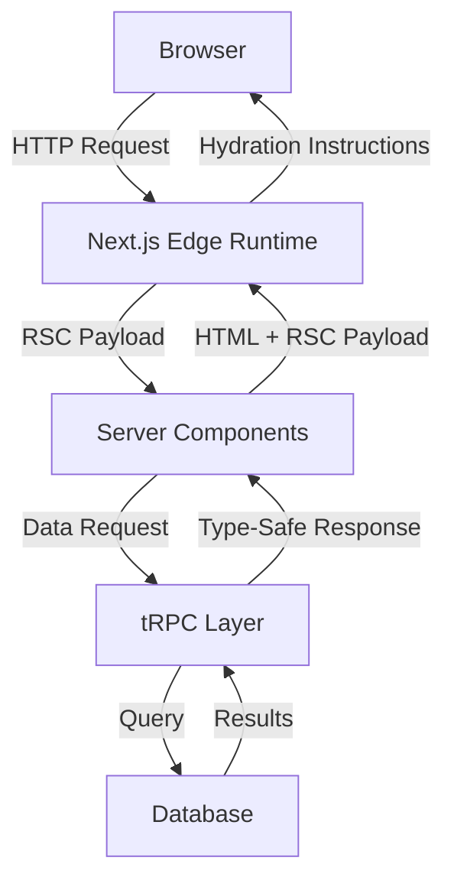

# Client Architecture Overview

## Tech Stack Overview

The client-side application is built on a modern, type-safe stack:

- **Next.js 13+**: React framework with App Router
- **TypeScript**: For type safety and developer experience
- **tRPC**: End-to-end typesafe API layer
- **TanStack Query**: Data synchronization and caching
- **Tailwind CSS**: Utility-first styling

## Directory Structure

```
client/
├── src/
│   ├── app/                 # Next.js App Router pages and layouts
│   ├── trpc/               # tRPC client configuration
│   │   ├── react.tsx       # Client-side tRPC setup
│   │   ├── server.ts       # Server-side tRPC utilities
│   │   └── query-client.ts # TanStack Query configuration
│   └── server/             # Server-side code (API routes, DB)
├── public/                 # Static assets
└── docs/                  # Documentation
```

## Key Architectural Patterns

### 1. Server Components First

The application follows the "server components by default" approach:

- Maximizes performance by reducing client-side JavaScript
- Enables direct database access in components
- Simplifies data fetching patterns

### 2. Hybrid Rendering Strategy

Implements a hybrid rendering approach:

- Static content: Generated at build time
- Dynamic content: Server-side rendered
- Interactive elements: Client-side hydration

### 3. Type-Safe Data Layer

Ensures end-to-end type safety through:

- TypeScript for static typing
- tRPC for API type inference
- Zod for runtime validation

## Data Flow Architecture



## Performance Optimizations

1. **Automatic Code Splitting**

   - Route-based splitting
   - Component-level code splitting
   - Dynamic imports for heavy components

2. **Data Caching Strategy**

   - Server-side caching
   - Client-side query caching
   - Optimistic updates

3. **Asset Optimization**
   - Image optimization
   - Font optimization
   - CSS minification

## Security Considerations

1. **API Security**

   - Type-safe endpoints
   - Input validation
   - CORS configuration
   - Rate limiting

2. **Data Protection**
   - XSS prevention
   - CSRF protection
   - Secure headers

## Development Workflow

1. **Local Development**

   ```bash
   npm run dev     # Start development server
   npm run build   # Production build
   npm run start   # Start production server
   ```

2. **Type Checking**

   ```bash
   npm run typecheck  # Run TypeScript compiler
   ```

3. **Linting**
   ```bash
   npm run lint    # Run ESLint
   ```

## Further Reading

- [tRPC Documentation](./2-trpc-integration.md)
- [Data Fetching Patterns](./3-data-fetching.md)
- [Component Architecture](./4-component-architecture.md)
- [State Management](./5-state-management.md)
- [Performance Guide](./6-performance.md)
